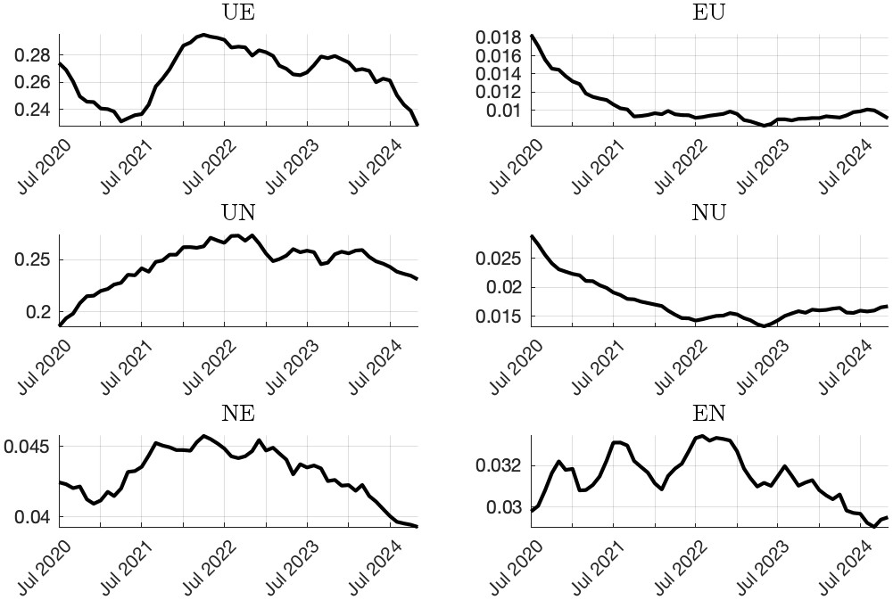
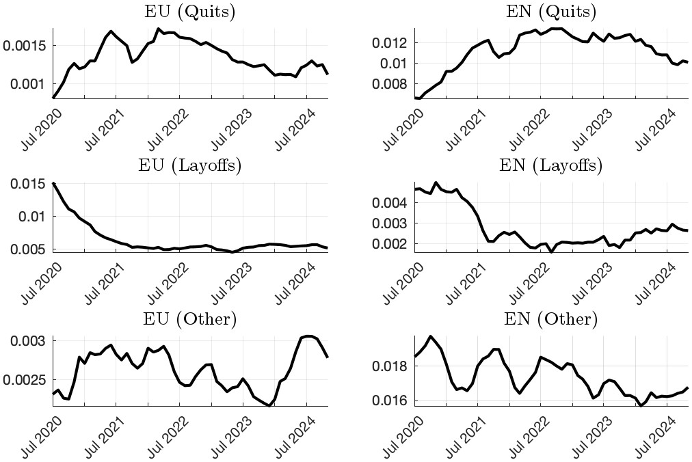

Labor market flow data from Graves, Huckfeldt, and Swanson (2024)
=================

This site hosts labor market flow data computed from Graves, Huckfeldt, and Swanson (2024, hereafter GHS). While we will also post data for flows between employment (*E*), unemployment (*U*), and nonparticipation (*N*), we hope that our data for a harmonized series of employment-to-nonparticipation (*EN*) flows into "quits", "layoffs", and "other" will be found especially useful. Such a decomposition is new to the literature and is described in Section 2.2 and Appendix B in the current draft of our paper (and also described in all other [previously circulating versions](https://www.nber.org/papers/w31770)).

See below for additional information, or skip right to the [download links](#downloads).

Table of Contents
=================

* [Findings from GHS on Quits and Layoffs](#findings-from-ghs-on-quits-and-layoffs)
* [Data availability](#data-availability)
    * [Labor market flows, 2020+](#labor-market-flows-2020)
    * [Comparison with JOLTS Classification Method](#comparison-with-jolts-classification-method)
    * [Downloads](#downloads)
* [Suggested citation](#suggested-citation)
* [References](#references)
* [Appendix: Additional Figures](#appendix-additional-figures)

<!-- Created by https://github.com/ekalinin/github-markdown-toc -->

## Findings from GHS on Quits and Layoffs
In GHS, we develop a methodology for generating a harmonized series of *EN* quits and layoffs from the CPS.

We use these data to document that [quits comprise a large proportion of *EN* flows and are procyclical](figures/fig_EU_EN_unconditional.jpg), helping drive the [overall procyclicality of EN flows](figures/tab_EU_EN_unconditional.jpg). *EN* and *EU* quits (layoffs) are unconditionally procyclical (countercyclical), but are also conditionally procyclical (countercyclical) [with respect to monetary policy shocks](figures/fig_EU_EN_mps.jpg). We develop a heterogeneous agent model with labor market frictions and an active labor supply margin that is able to replicate the [response of labor market flows](figures/fig_labor_flows_model_data.jpg) with respect to a contractionary monetary policy shock, [including EU/EN quits and layoffs](figures/fig_EU_EN_model_data.jpg).

In Appendix B.2, we document further properties of *EN*/*EU* quits and layoffs from the data, including that workers from non-employment are more likely to leave or stay out of the labor force in subsequent months, whereas workers who are laid-off to non-employment are more likely to rejoin or remain in the labor force in subsequent months. These patterns hold regardless of whether the worker initially separates to either [unemployment](figures/fig_post_EU.jpg) or [nonparticipation](figures/fig_post_EN.jpg).

## Data availability
While the analysis of the paper is focused on the pre-pandemic period (1978-2019), here we provide current data, updating our series as new data are made available from IPUMS.

### Labor market flows, 2020+
The data for the sample considered in GHS is summarized in Tables [2](figures/tab_all_flows) and [3](figures/tab_EU_EN_unconditional) of the main paper, and we provide plots in Figures [A.1](figures/fig_all_flows.jpg) and [A.2](figures/fig_EU_EN_components.jpg) of the Appendix.

[Below](#appendix-additional-figures), we plot the data from 2020:Q3 to the present. The data series for *EU* and *UE* show the fast labor market recovery from COVID, with the later decline in *UE* flows consistent with a gradual cooling of the labor market. Note, although *EN* quits increase and *EN* layoffs decline through 2022, the aggregate *EN* series shows a zig-zag pattern, where the troughs appear to coincide with the start of new Covid waves. Our decomposition shows that this pattern is due to workers whose exit from employment cannot be categorized as a quit or layoff from CPS survey answers, e.g., workers who exit their job for reported reasons of retirement or disability.

### Comparison with JOLTS Classification Method

As discussed in the Appendix of GHS, our definition of "quits", "layoffs" and "other separations" differs slightly from those in the [Job Openings and Labor Turnover Survey](https://www.bls.gov/jlt/jltdef.htm). Specifically, we label the end of temporary or seasonal jobs (i.e., fixed-term jobs) as "other separations", whereas the JOLTS classifies such separations as "layoffs". For comparability, we also provide data using the JOLTS definition. Researchers should be aware that using the JOLTS definition leads to a structural break in the *EN* "layoff" and *EN* "other" transition rates around the redesign of the CPS in 1994. We discuss the source of this break in the Appendix of GHS.

### Downloads
Four files are available:
- [GHS_Labor_Flows_nonSA.csv](data/GHS_Labor_Flows_nonSA.csv) contains the non-seasonally-adjusted labor market flows data, as in GHS
- [GHS_Labor_Flows_SA.csv](data/GHS_Labor_Flows_SA.csv) contains the same data as above, but seasonally adjusted using X13-ARIMA
- [GHS_Labor_Flows_nonSA_JOLTSdef.csv](data/GHS_Labor_Flows_nonSA_JOLTSdef.csv) contains the non-seasonally-adjusted labor market flows data, using the JOLTS definition of layoffs
- [GHS_Labor_Flows_SA_JOLTSdef.csv](data/GHS_Labor_Flows_SA_JOLTSdef.csv) contains the labor market flows data using the JOLTS definition of layoffs (as above), but seasonally adjusted using X13-ARIMA

## Suggested citation
Researchers who using data from this page (or who apply our decomposition of *EN* transitions into quits and layoffs) should cite the latest version of our NBER working paper:

    Sebastian Graves, Christopher Huckfeldt, and Eric T. Swanson, "The Labor Demand and Labor Supply Channels of Monetary Policy," Working Paper 31770, October 2024

## References

Flood, Sarah, Miriam King, Renae Rodgers, Steven Ruggles, J. Robert Warren, Daniel Backman, Annie Chen, Grace Cooper, Stephanie Richards, Megan Schouweiler, and Michael Westberry. IPUMS CPS: Version 12.0 [dataset]. Minneapolis, MN: IPUMS, 2024.  [https://doi.org/10.18128/D030.V12.0](https://doi.org/10.18128/D030.V12.0)

## Appendix: Additional Figures

  
|  | 
|:--:| 
| **Labor market flows, 2020:Q3+** *Transition rates are calculated using CPS microdata as described in GHS. All series are smoothed using a centered 5-month moving average.*|

  
|  | 
|:--:| 
| **Labor market flows, 2020:Q3+** *Transition rates are calculated using CPS microdata as described in GHS. All series are smoothed using a centered 5-month moving average.*|

